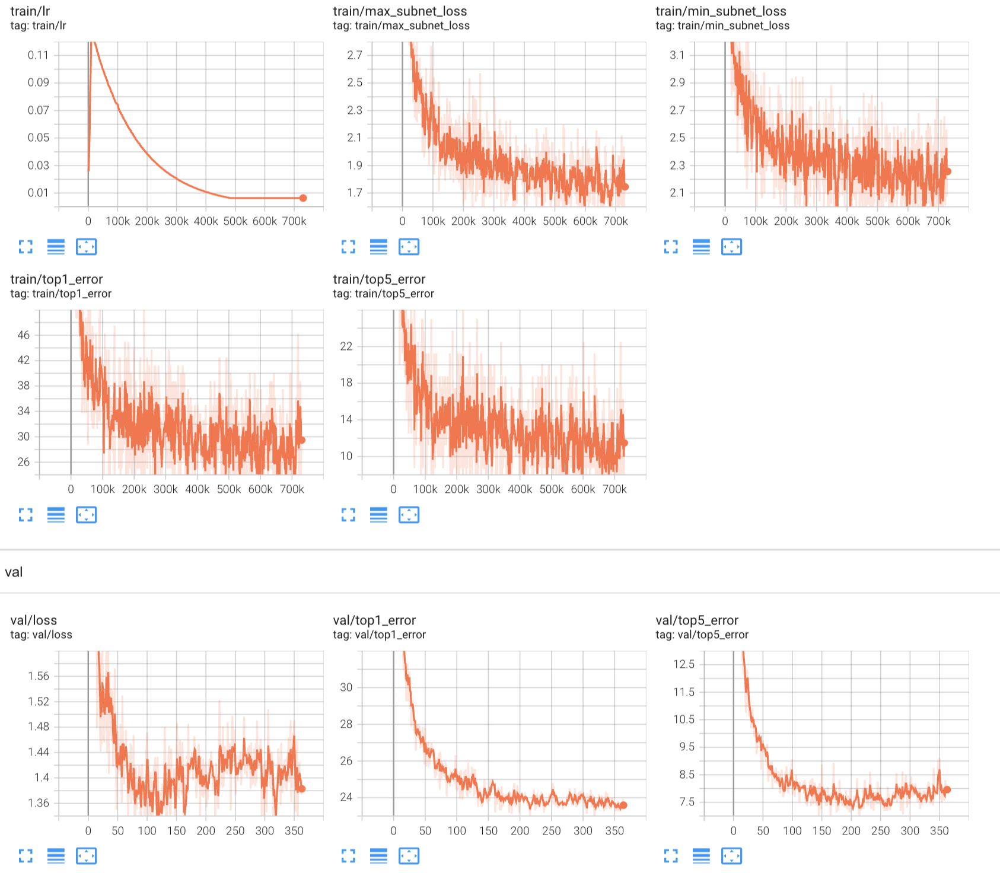

# PyTorch-BigNAS

<p>
  <a href="https://img.shields.io/badge/Python-%3E%3D3.7-blue"></a>
  <a href="https://img.shields.io/badge/PyTorch-1.9-informational"></a>
  <a href="https://img.shields.io/badge/License-MIT-brightgreen"></a>
</p>


Unofficial [PyTorch](http://pytorch.org/) implementation of BigNAS: Scaling Up Neural Architecture Search with Big Single-Stage Models.

> Yu J, Jin P, Liu H, et al. Bignas: Scaling up neural architecture search with big single-stage models[C]//European Conference on Computer Vision. Springer, Cham, 2020: 702-717.

Paper link: [Arxiv](https://arxiv.org/abs/2003.11142)


## Requirements

- Python >= 3.7
- PyTorch = 1.9

**Other requirements** are listed in the `requirements.txt`.

### Data Preparation

It is highly recommended to save or link datasets to the `$pytorch-BigNAS/data` folder, thus no additional configuration is required. However, manually setting the path for datasets is also available by modifying the `cfg.LOADER.DATAPATH` attribute in the configuration file `$pytorch-BigNAS/core/config.py`.

BigNAS uses ImageNet for training only, thus you can simply link ImageNet to the `data/imagenet` folder like this:

```
ln -s /PATH/TO/IMAGENET $pytorch-BigNAS/data/imagenet
```


## Run example

Adjust the batch size (and other parameters accordingly) if out of memory (OOM) occurs.

- Train Supernet (Multi-GPU only)
  `python train_supernet.py --cfg configs/train.yaml`
- Search
  `python search.py --cfg configs/search.yaml`
- Evaluation
  `python eval.py --cfg configs/eval.yaml`

The configuration file can be overridden by adding or modifying additional parameters on the command line. For example, run `eval.py` with the modified output directory could be like:
`python eval.py --cfg configs/eval.yaml OUT_DIR exp/220621/`


## Results

We performed the supernet training period using 8 Nvidia Tesla V100 GPUs, and the total time spent was about 16 days. The supernet training results are as follows:


| Arch        | Accuracy (top-1) | Accuracy (top-5) |
| ----------- | ---------------- | ---------------- |
| MAX (final) | 79.60            | 93.89            |
| MAX (best)  | 79.89            | 94.52            |
| MIN (final) | 74.32            | 91.46            |
| MIN (best)  | 74.72            | 91.84            |


We note that this produces a performance degradation of about 1% from the original paper. This may be due to different specific settings. In practice, we are following most configurations from `AttentiveNAS`. However, since we reduce the number of running GPUs, the exact results may vary depending on the different hyperparameters. The parts that we have modified in the actual runtime are as follows:


| Modified items     | In paper                       | This code    |
| ------------------ | ------------------------------ | ------------ |
| #GPUs              | 64                             | 8            |
| batch_size per GPU | 64                             | 80           |
| learning_rate      | 0.256                          | 0.128        |
| optimizer          | RMSProp                        | SGD          |
| weight_decay       | 1e-5 for the biggest arch only | 3e-6 for all |


The learning curves from the `tensorboard` are as follows:




**Note:** 

We notice that the learning curves of the supernet produced a large **oscillation** under this setting, which may cause the performance drop and training instability. However, due to the resource constraints (125 GPU-days per training using Tesla V100), I am unable to make detailed adjustments and fine-tune the hyper-parameters at this time. If you use this code to run and get better results, we would appreciate you submitting it to us via Pull Requests.


## Contributing

We welcome contributions to the library along with any potential issues or suggestions.

Also, if you find this code useful, please consider leaving a star🌟.


## Reference

This implementation is mainly adapted from the source code of XNAS, AttentiveNAS, and OFA.

- [XNAS](https://github.com/MAC-AutoML/XNAS)
- [AttentiveNAS](https://github.com/facebookresearch/AttentiveNAS)
- [OFA](https://github.com/mit-han-lab/once-for-all)

### About XNAS

[XNAS](https://github.com/MAC-AutoML/XNAS) is an effective, modular, and flexible Neural Architecture Search (NAS) repository, which aims to provide a common framework and baselines for the NAS community. It is originally designed to decouple the search space, search algorithm, and performance evaluation strategy to achieve a freely combinable NAS.